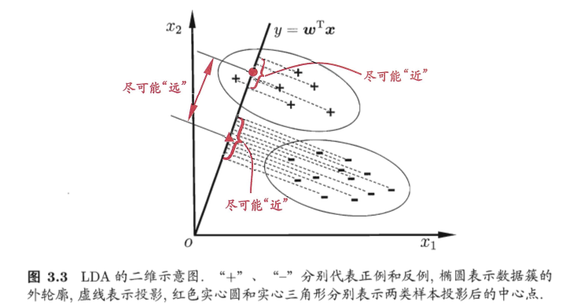

1. 基本形式
    线性模型：
    $f(x)=w_1x_1+w_2x_2+...+w_dx_d+b$

    向量形式为： 
    $f(x)=\bm{w^Tx}+b$

    通过学习 $\bm{w}$ 和 $b$ 确定模型

2. 线性回归
线性回归试图学得 \
$f(x_i)=wx_i+b_i$, 使得$f(x_i) \simeq y_i$ \
最小二乘法：使均方误差最小化\
$(w^*,b^*)= \argmin\limits_{(w,b)}\sum_{i=1}^{m}(f(x_i)-y_i)^2$ \
$=\argmin\limits_{(w,b)}\sum_{i=1}^{m}(y_i-wx_i-b)^2$ \
求解 $w$ 和 $b$ 使 $E_(w,b)=\sum_{i=1}^{m}(y_i-wx_i-b)^2$ 最小化的过程，称为线性回归模型的最小二乘“参数估计”。

更一般地，当样本有 $d$ 个属性时，多元回归线性模型使得 \
$f(x_i)=\bm{w^Tx_i}+b$ , $f(\bm{x_i})\simeq{y_i}$

$\bm{\hat{w}^*} = \argmin\limits_{\bm{\hat{w}}}(y-\bf{X}\bm{\hat{w}})^T(\bm{y}-\bf{X}\bm{\hat{w}}-\bm{y})$

当$\bf{X^TX}$为满秩矩阵或正定矩阵时：\
$\bm{\hat{w}^*}=\bf{(X^TX)^{-1}X^T}\bm{y}$ \
$f(\bm{\hat{x_i}})=\bm{\hat{x_i}^T}\bf{(X^TX)^{-1}X^T}\bm{y}$

然而，现实往往不是满秩矩阵：变量数目超过样本数。此时可以解出多个 $\hat{\bm{w}}$ 使均方误差最小，选择哪一个解作为输出**由学习算法的归纳偏好决定，常见的作法是引入正则化项（regularization）** \

对数线性回归: ln $y=\bm{w^{\textnormal{T}}x}+b$
对数线性回归形式上仍然是线性回归，但实质上已是在求取输入空间到输出空间的非线性函数映射。

广义线性模型：$y=g^{-1}(\bm{w}^{\textnormal{T}}\bm{x}+b)$

3. 对数几率回归
对数几率函数（logistic regression）: $y=\frac{1}{1+e^{-z}}$ \
可推导出： ln $\frac{y}{1-y}=\bm{w}^{\textnormal{T}}\bm{x}+b$

逻辑回归模型的预测结果逼近真实标记的对数几率。直接对分类可能性进行建模，无需事先假设数据分布，避免了假设分布不准确带来的问题，可以得到近似概率预测。对率函数为任意阶可导凸函数，有很好的数学性质，现有的许多数值优化算法可以直接用于求取最优解。可以通过最大似然估计求解$w$ 和 $b$。

4. 线性判别分析（Linear Discriminanat Analysis, LDA） \

LDA目标：同类样本投影尽可能接近，异类样本投影尽可能远离。\
类内散度矩阵： $\bf{S}_{\bm{w}}=\Sigma_{0}+\Sigma_{1} \\$
=$\sum\limits_{\bm{x}\in{X_0}}(\bm{x-\mu_0})(\bm{x-\mu_0})^\textnormal{T} + \sum\limits_{\bm{x}\in{X_1}}(\bm{x-\mu_1})(\bm{x-\mu_1})^\textnormal{T}$ 

类间散度矩阵：$\bf{S}_{\bm{b}}=\bm{(\mu_0-\mu_1)(\mu_0-\mu_1)}^T$
LDA最大化目标： $J=\frac{\bm{w}^\textnormal{T}\bf{}S_{\bm{b}}\bm{w}}{\bm{w}^\textnormal{T}\bf{}S_{\bm{w}}\bm{w}}$

5. 多分类学习 \
将多分类任务拆解为若干个二分类任务求解，为拆出的每个二分类任务训练一个分类器。常见的拆分策略有：一对一（OvO）;一对其余（OvR）;多对多（MvM）。
OvR训练N个分类器，OvO训练 $N(N-1)/2$ 个分类器。
MvM: 纠错输出码（Error Correcring Output Codes, ECOC）:point_left:

6. 类别不平衡 (class-imbalance)问题 
指分类任务中不同类别的训练样本数目差别很大。

* 再缩放：\
分类器预测 $\frac{y}{1-y}>1$ 时为正；训练集中 $m^+$ 为正例数目，$m^-$ 为反例数目，观测几率为 $\frac{m^+}{m^-}$, 当 $\frac{y}{1-y}>\frac{m^+}{m^-}$ 时分类器预测训练样本为正，于是令

$\frac{y^{\prime}}{1-y^{\prime}}=\frac{y}{1-y}\times{\frac{m^+}{m^-}}$

训练集不是真实样本的无偏采样：
    - 对反例欠采样,去除反例（undersampling）
    - 对正例过采样，增加正例（oversampling）
    - 直接基于原始训练集进行学习，但在用训练好的分类器进行预测时，将再缩放公式嵌入决策过程中，即阈值迁移。