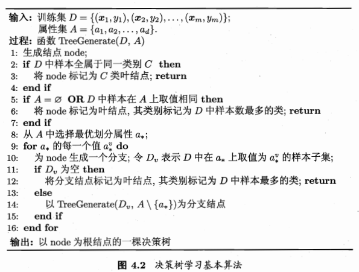
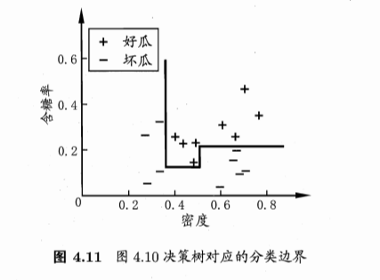

#c4 Decision tree

1. 基本流程 \
一般的，一棵决策树包含一个根结点、若干个内部节点和若干个叶节点。叶节点对应于决策结果，其他每个节点对应于一个属性测试。每个结点包含的样本集合根据属性测试的结果被划分到子节点中，根节点包含样本全集。从根节点到每个叶节点的路径对应了一个判定测试序列。决策树学习的目的是为了产生一个泛化能力强的决策树。

决策树的生成是一个递归过程，有三种情况会导致递归返回
1. 当前节点包含的样本全部属于同一类别，无需划分。
2. 当前属性集为空，或所有样本在所有属性上的取值相同，无法划分。把当前节点标记为叶节点，并将其类别设定为改节点所含样本最多的类别。利用当前节点的后验分布。
3. 当前节点包含的样本集合为空，不能划分。 把当前节点标记为叶节点，但将其类别设定为其父节点所含样本最多的类别。把父节点的样本分布作为当前节点的先验分布。

2. 划分选择 \
随着划分过程不断进行，希望决策树的分支系欸但所包含的样本尽可能属于同一类别，即节点的纯度越来越高。

2.1 信息熵 \
$\textnormal{Ent}(D)=-\sum_{k=1}^{|y|}p_k\textnormal{log}_2p_k$ 
$p_k$为当前样本集合$D$中第$k$类样本所占比例，$\textnormal{ENT}(D)$的值越小，$D$的纯度越高。$\textnormal{ENT}(D)$ 最小值为0，最大值为 $\textnormal{log}_2|y|$。
对样本集 $D$ , 假定离散属性 $a$ 有 $V$ 个可能的取值，使用 $a$ 对 $D$ 进行划分，则会产生 $V$ 个分支节点，其中第 $v$ 个分支节点包含了 $D$ 中所有在属性 $A$ 上取值为 $a^v$ 的样本，记为 $D^v$, 可计算 $D^v$ 信息熵，考虑到不同的分支节点所包含的样本数不同，给分支节点赋予权重 $|D^v|/|D|$, 集样本数越多的分支节点影响越大，于是可计算出用属性 $a$ 对样本集 $D$ 进行划分所获得的“信息增益”\
$\textnormal{Gain}(D,a) = \textnormal{Ent}(D)-\sum_{v=1}^{V}\frac{|D^v|}{|D|}\textnormal{Ent}(D^v)$
**一般而言，信息增益越大，则意味着使用属性$a$来进行划分所获得的“纯度提升”越大。我们可以使用信息增益来进行决策树的划分属性选择。**

2.2 增益率 \
信息增益准则对可取值数目较多的属性有偏好，为减少这种偏好可能带来的不利影响，可使用增益率来选择最优划分属性：
 $\textnormal{Gain\_ratio}(D,a)= \frac{\textnormal{Gain}(D,a)}{\textnormal{IV}(a)}$ ，
其中 
$\textnormal{IV}(a)=-\sum_{v=1}^{V}\frac{|D^v|}{|D|}\textnormal{log}_2\frac{|D^v|}{|D|}$ 
$IV$为属性$a$的固有值，属性$a$的可能取值数目越多，即$V$越大，$\textnormal{IV}(a)$的值通常会越大。
**增益率准则对可取值数目较少的属性有所偏好，算法先从候选划分属性中找出信息增益高于平均水平的属性，再从中选择增益率最高的。**

2.3 基尼指数 (Gini Index baedn on Classification and Regression Tree, CART 决策树) \
用Gini Index衡量数据集纯度：\
$\textnormal{Gini}(D) = \sum_{k=1}^{|y|}\sum_{k\prime\neq{k}}^{}p_kp_{k{\prime}}$
\=$\textnormal{1}-\sum_{k=1}^{|y|}p_k^{2}$\
$\textnormal{Gini}(D)$反映了从数据集$D$中随机抽取连个样本，其类别标记不一致的概率，$\textnormal{Gini}(D)$ 越小，数据集$D$的纯度越高。
属性$a$的基尼指数定义为 

$\textnormal{Gini\_index}(D,a)=\sum_{v=1}^{V}\frac{|D^v|}{|D|}\textnormal{Gini}(D^v)$\
于是，我们在属性集合$A$中，选择那个使得划分后基尼指数最小的属性作为最优划分属性。即$a_* = \argmin\limits_{a\in{A}} \textnormal{Gini\_index}(D,a)$.

3. 剪枝处理 (prunning)\
 用于处理过拟合的主要手段，可分为：
- 预剪枝：在决策树生成过程中在划分前估计每个节点。预剪枝使得决策树的很多分支都没有展开，这不仅降低了过拟合的风险，还显著减少了决策树的训练时间和测试时间。但是有欠拟合的风险。
- 后剪枝：先从训练集生成一棵完整的决策树，然后自底向上对非叶节点进行考察，将该节点对应的子树替换为叶节点能否带来决策树泛化性能的提升。一般情况下，后剪枝决策树的欠拟合风险很小，泛化性能往往优于预剪枝决策树，但后剪枝过程是在安全生成决策树之后进行的，并且要自底向上对树中所有非叶节点进行逐一考察，因此其训练时间开销比预剪枝决策树大。\

4. 连续与缺失值 \

4.1 连续属性离散化技术, 二分法 \
对于样本集$D$ 和连续属性$a$, 基于任意划分点$t$将$D$分为2部分。**对于划分点的集合进行类似离散属性值的考察，选取最优的划分点进行样本集合的划分。** \
$T_a = \left\{ \frac{a^i+a^{i+1}}{2}|1\le i\le n-1\right\}$ \
**与离散属性不同，若当前节点划分属性为连续属性，该属性还可作为其后代节点的划分属性** \

4.2 缺失值处理 \
1. 如何在属性值缺失的情况下进行划分属性选择？计算信息增益的时候乘以完整数据所占百分比,来比较各个节点信息增益。 \
2. 给定划分属性，若样本在该属性上的值缺失，如何对样本进行划分？让同一个样本以不同的概率划入到不同的子节点中去。在该样本无缺失样本中计算信息增益。缺失样本同时进入所有分支，但权重不同。\

5. 多变量决策树（Multivariate decision tree） \
* 分类边界

:v:

